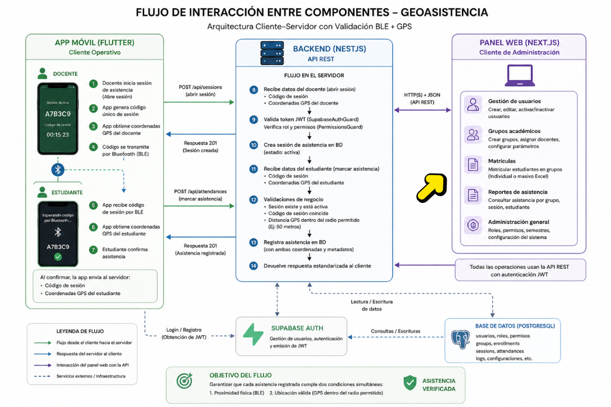
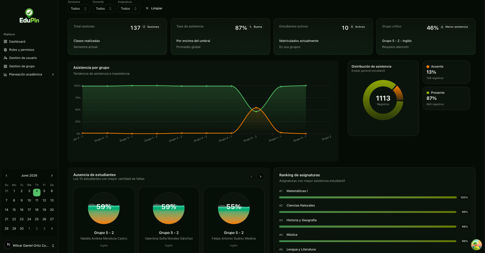
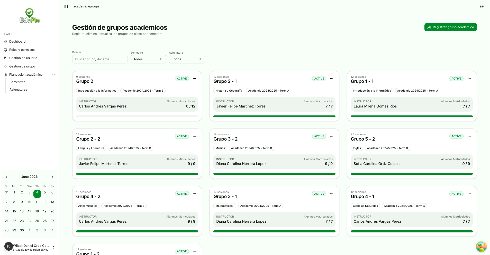
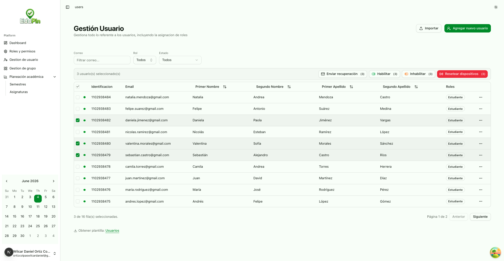
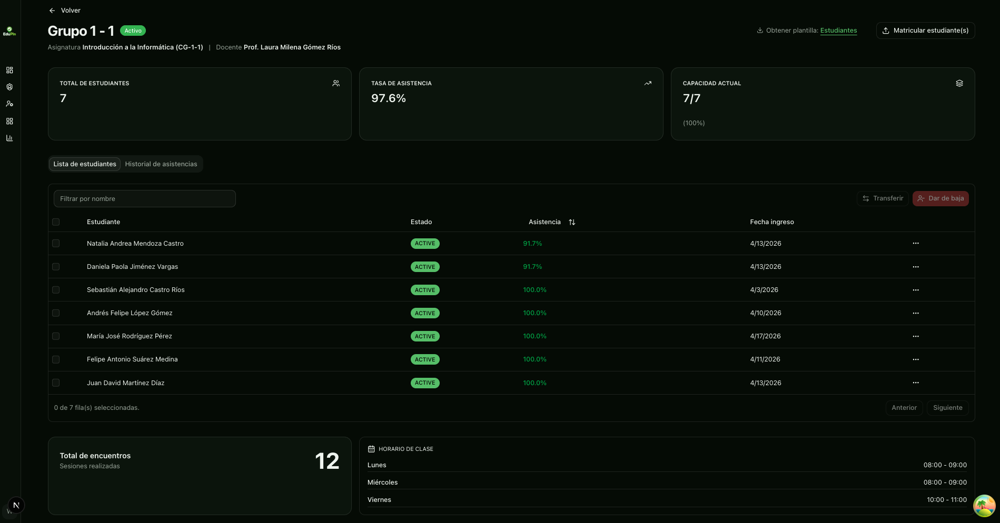

<p align="center">
  
</p>
<h1 align="center">GeoAsistencia (Panel Web)</h1>

<p align="center">
  
  
  
  
  
</p>

---

## ✨ Descripción general

**GeoAsistencia** (nombre de la app) es el panel web de administración del sistema GeoAsistencia. A diferencia de la aplicación móvil —orientada al llamado a lista en campo mediante BLE + GPS—, el panel web está diseñado para usuarios con roles de **Administrador** y **Docente** que necesitan gestionar el sistema desde escritorio.

Toda la lógica de negocio reside en el backend REST `GeoAsistencia_BACKEND` (NestJS). El panel web consume esa API mediante peticiones HTTP autenticadas con JWT emitido por **Supabase Auth**.

<p align="center">
  
</p>

---

## 🛠️ Stack tecnológico

| Capa | Tecnología |
|---|---|
| Framework | Next.js 15 (App Router) |
| Lenguaje | TypeScript |
| Estilos | Tailwind CSS |
| Componentes UI | shadcn/ui (Radix UI) |
| Autenticación | Supabase Auth (`@supabase/ssr`) |
| HTTP Client | Axios (cliente y servidor) |
| Estado del servidor | TanStack Query (React Query) |
| Formularios | React Hook Form + Zod |
| Notificaciones | Sonner |
| Gráficas | Recharts (via shadcn/ui chart) |
| Iconos | Lucide React |

---
## 🐳 Docker

```bash
# Construir imagen
docker build -t geoasistencia-frontend .

# Ejecutar contenedor
docker run -d \
  --name geoasistencia-frontend \
  -p 3000:3000 \
  --env-file .env \
  geoasistencia-frontend
```

## 🎯 Funcionalidades por rol

### Administrador (`ADMIN` / `SUPER_ADMIN`)
- Crear, editar y gestionar usuarios (docentes y estudiantes) de forma individual o **carga masiva desde Excel**.
- Asignar y actualizar roles de usuario.
- Crear y gestionar semestres académicos (con estados: `Planeado`, `Activo`, `Finalizado`, `Cancelado`) y asignaturas.
- Crear grupos de clase y asignarles docente, horarios y asignatura.
- Matricular estudiantes en grupos de forma individual o **masiva desde Excel**.
- Mover o retirar estudiantes entre grupos.
- Gestionar roles y su matriz de permisos.
- Visualizar el **dashboard** con métricas globales, ranking de asignaturas, barras de asistencia por grupo, gráfico de distribución (Presente / Ausente / Tarde) y tabla de estudiantes con más ausencias — filtrable por semestre, docente y asignatura.

### Docente (`TEACHER`)
- Ver los grupos de clase asignados con filtros por semestre y asignatura.
- Consultar la lista de estudiantes matriculados en cada grupo con su porcentaje de asistencia acumulado.
- Ver el historial de sesiones del grupo y el detalle de asistencias por sesión.
- Acceder al **dashboard** con métricas de sus propios grupos.

> **Nota:** el llamado a lista en tiempo real (BLE + GPS) se realiza **exclusivamente desde la app móvil**. El panel web sirve para administración, consulta y reportes.

---

## 🗂️ Estructura del proyecto

```
src/
├── actions/                    # Server Actions de Next.js
│   └── auth/
│       ├── auth.ts             # login, signOut, sendRecoveryEmail
│       └── get-user.ts         # getProfile, isUserActive
│
├── app/
│   ├── (auth)/                 # Rutas públicas de autenticación
│   │   ├── login/
│   │   ├── forgot-password/
│   │   ├── reset-password/
│   │   ├── confirm/            # Callback de Supabase Auth
│   │   └── error/
│   │
│   └── (routes)/               # Rutas protegidas (requieren sesión)
│       ├── layout.tsx           # Layout con AppSidebar + Breadcrumb + ThemeToggle
│       ├── dashboard/           # Dashboard con métricas y gráficas
│       ├── users/               # Gestión de usuarios ([id]/, create/)
│       ├── academic-groups/     # Grupos académicos ([id]/details/, [id]/edit/, create/)
│       ├── planning-academic/
│       │   ├── semester/        # Gestión de semestres
│       │   └── subject/         # Gestión de asignaturas
│       └── roles/               # Roles y matriz de permisos
│
├── components/
│   ├── layout/
│   │   └── AppSidebar/         # Sidebar colapsable con navegación dinámica
│   ├── providers/
│   │   ├── query-provider.tsx  # TanStack Query
│   │   └── theme-provider.tsx  # next-themes (claro/oscuro/sistema)
│   ├── shared/                 # Componentes reutilizables
│   │   ├── Can.tsx             # Control de acceso declarativo por permiso/rol
│   │   ├── BulkImportButton.tsx # Importación masiva desde Excel
│   │   ├── TemplateDownload.tsx # Descarga de plantillas Excel
│   │   ├── Pagination.tsx
│   │   ├── PageHeader.tsx
│   │   ├── MetricCard.tsx
│   │   ├── DynamicBreadcrumb.tsx
│   │   ├── AlertDialogDestructive.tsx
│   │   └── ...skeletons y campos de formulario
│   └── ui/                     # Componentes base de shadcn/ui
│
├── context/
│   └── authContext.tsx         # AuthProvider: usuario, permisos, navegación, isLoading
│
├── features/                   # Tipos y constantes por dominio
│   ├── classGroup/
│   ├── dashboard/
│   ├── roleAndPermission/
│   ├── semester/
│   ├── subject/
│   └── User/
│
├── hooks/
│   ├── ApiList.ts              # Hooks de listas para selects (semestres, docentes, roles…)
│   ├── usePermission.ts        # can(), hasRole(), canAny(), canAll()
│   └── use-mobile.ts
│
├── lib/
│   ├── api/
│   │   ├── api_client.ts       # Axios client-side con token Supabase automático
│   │   ├── api_server.ts       # Axios server-side con token Supabase automático
│   │   └── helper.ts           # Wrappers get/post/patch/delete/getBlob
│   ├── supabase/
│   │   ├── client.ts           # createBrowserClient
│   │   ├── server.ts           # createServerClient (cookies)
│   │   └── proxy.ts
│   └── utils.ts                # cn() (clsx + tailwind-merge)
│
├── constants/
│   └── permissions.ts          # Mapa completo de permisos del sistema (PERMISSIONS)
│
├── types/
│   ├── api.ts                  # ApiResponse<T>, PaginatedData<T>
│   ├── user.ts                 # UserProfile, NavigationItem
│   ├── weekDay.ts
│   └── index.ts
│
├── utils/
│   ├── groupSchedules.ts       # Agrupa horarios de clase por franja horaria
│   └── icons.ts                # Mapeo de nombre de icono → componente Lucide
│
└── proxy.ts                    # Configuración del proxy de Supabase
```


<h2>📱 Capturas de pantalla</h2>

<p align="center">
  
  
</p>

<p align="center">
  
  
</p> 


## 🔐 Autenticación y sesión

El flujo de autenticación está completamente delegado a **Supabase Auth**:

1. El usuario ingresa email y contraseña en `/login`.
2. La Server Action `login()` llama a `supabase.auth.signInWithPassword()`.
3. El `AuthProvider` escucha `onAuthStateChange` y, ante un `SIGNED_IN`, llama al backend en `GET /user/me` para obtener el perfil completo (datos del usuario, roles, permisos y menú de navegación).
4. El JWT de Supabase se inyecta automáticamente en cada petición Axios mediante interceptores, tanto en el cliente (`api_client.ts`) como en el servidor (`api_server.ts`).
5. Al cerrar sesión, `signOut()` limpia la sesión en Supabase y el contexto se resetea.

La recuperación de contraseña fluye por email con redirección a `/confirm` → `/reset-password`.

### Variables de entorno

```env
# URL base de la API del backend (NestJS)
NEXT_PUBLIC_NEST_API_URL=http://localhost:3001/api

# Credenciales de Supabase
NEXT_PUBLIC_SUPABASE_URL=https://<referencia>.supabase.co
NEXT_PUBLIC_SUPABASE_ANON_KEY=sb_publishable_...
```

---

## 🧩 Sistema de roles y permisos

### Roles del sistema

| Rol | Constante | Badge |
|---|---|---|
| Super administrador | `SUPER_ADMIN` | `destructive` |
| Administrador | `ADMIN` | `default` |
| Docente | `TEACHER` | `secondary` |
| Estudiante | `STUDENT` | `outline` (solo app móvil) |

### Permisos disponibles

Los permisos se definen en `src/constants/permissions.ts` y se agrupan por módulo:

| Módulo | Permisos |
|---|---|
| Usuarios | `ver_usuarios`, `crear:usuario`, `editar_usuario`, `activar_usuario`, `desactivar_usuario`, `importar:usuarios`, `recuperar_password`, `descargar_plantilla_usuarios` |
| Asignaturas | `ver_asignaturas`, `crear_asignatura`, `editar_asignatura`, `eliminar_asignatura`, `importar_asignaturas`, `descargar_plantilla_asignaturas` |
| Semestres | `planeacion`, `ver_semestres`, `crear_semestre`, `editar_semestre`, `cambiar_estado_semestre`, `eliminar_semestre` |
| Grupos | `ver_grupos`, `crear_grupo`, `editar_grupo`, `eliminar_grupo`, `gestionar_horarios`, `ver_estudiantes_grupo`, `matricular_estudiantes`, `retirar_estudiantes`, `transferir_estudiantes`, `descargar_plantilla_grupo` |
| Roles | `manage:role` |
| Reportes | `ver:reportes`, `exportar_reportes` |

### Control de acceso en componentes

El hook `usePermissions()` expone cuatro métodos:

```tsx
const { can, hasRole, canAny, canAll } = usePermissions();

can("crear:usuario")          // true/false para un permiso
hasRole("ADMIN")              // true/false para un rol
canAny(["editar_grupo", "crear_grupo"])  // al menos uno
canAll(["ver_grupos", "editar_grupo"])   // todos
```

El componente `<Can>` permite control declarativo:

```tsx
<Can permission="crear:usuario">
  <Button>Crear usuario</Button>
</Can>

<Can role="ADMIN" fallback={<p>Sin acceso</p>}>
  <AdminPanel />
</Can>
```

---

## 🧭 Navegación dinámica

El sidebar construye su menú automáticamente a partir de la respuesta de `GET /user/me`, que incluye el campo `navigation` con el árbol de rutas según el rol del usuario. El componente `AppSidebar` renderiza este árbol a través de `NavSettings`, convirtiendo los nombres de iconos (strings) en componentes Lucide mediante `src/utils/icons.ts`.

---

## 📡 Cliente HTTP

Hay dos instancias de Axios pre-configuradas:

| Instancia | Uso | Archivo |
|---|---|---|
| `apiClient` | Client Components, hooks de React Query | `lib/api/api_client.ts` |
| `apiServer` | Server Actions, Server Components | `lib/api/api_server.ts` |

Ambas comparten los wrappers de `helper.ts`:

```ts
apiClient.get<T>(url)
apiClient.post<T>(url, data, config?)
apiClient.patch<T>(url, data?)
apiClient.delete<T>(url)
apiClient.getBlob(url)   // para descargas de archivos
```

Todas las respuestas siguen el formato estándar del backend:

```ts
interface ApiResponse<T> {
  ok: boolean;
  statusCode: number;
  data: T;
  message?: string;
}
```

Las respuestas paginadas usan:

```ts
interface PaginatedData<T> {
  data: T[];
  total: number;
  page: number;
  limit: number;
  totalPages: number;
}
```

---

## 📊 Dashboard

El dashboard se adapta automáticamente al rol del usuario y consume distintos endpoints:

| Widget | Admin | Docente |
|---|---|---|
| Resumen general | `/dashboard/admin/overview` | `/dashboard/teacher/overview` |
| Asistencia por grupo | `/dashboard/admin/attendance` | `/dashboard/teacher/attendance` |
| Distribución (Presente/Ausente/Tarde) | `/dashboard/admin/distribution` | `/dashboard/teacher/distribution` |
| Ranking | `/dashboard/admin/subjects-ranking` | `/dashboard/teacher/groups-ranking` |
| Ausencias de estudiantes | `/dashboard/admin/students-absences` | `/dashboard/teacher/students-absences` |

El admin puede filtrar por semestre, docente y asignatura. Los datos se obtienen con TanStack Query y se renderizan con componentes de Recharts.

---

## 🗃️ Carga masiva desde Excel

El componente `<BulkImportButton>` maneja la importación masiva de forma genérica:

```tsx
<BulkImportButton
  endpoint="/user/bulk/import"
  queryKey="users"
  label="Importar usuarios"
/>
```

- Acepta archivos `.xlsx` / `.xls`.
- Envía el archivo como `multipart/form-data` con el campo `file`.
- Muestra notificaciones de éxito con la cantidad de registros creados.
- En caso de errores parciales, lista fila a fila los registros fallidos con su descripción.
- Invalida automáticamente las queries de TanStack Query afectadas tras la importación.

El componente `<TemplateDownload>` permite descargar las plantillas Excel desde los endpoints `GET .../bulk/template` usando `apiClient.getBlob()`.

---

## 🔗 Conexión con el backend

El panel web consume la API REST de **GeoAsistencia_BACKEND** (NestJS). La documentación interactiva de los endpoints está disponible en Swagger:

```
http://localhost:3001/api/doc
```

### Endpoints consumidos

####  Autenticación
| Método | Endpoint | Descripción |
|---|---|---|
| `GET` | `/user/me` | Perfil completo: datos, roles, permisos y menú |
| `GET` | `/user/is-active?email=` | Verifica si el usuario está activo |

####  Usuarios
| Método | Endpoint | Descripción |
|---|---|---|
| `POST` | `/user` | Registrar usuario individual |
| `GET` | `/user` | Listar usuarios con paginación |
| `PATCH` | `/user/:id` | Actualizar datos del usuario |
| `PATCH` | `/user/:id/roles` | Asignar/actualizar roles |
| `POST` | `/user/bulk/import` | Carga masiva desde Excel |
| `GET` | `/user/bulk/template` | Descargar plantilla Excel |

####  Académico
| Método | Endpoint | Descripción |
|---|---|---|
| `POST` | `/semesters` | Crear semestre académico |
| `GET` | `/semesters` | Listar semestres (paginado) |
| `GET` | `/semester/all` | Listar semestres para selects |
| `PATCH` | `/semesters/:id` | Actualizar semestre |
| `PATCH` | `/semesters/:id/state` | Cambiar estado del semestre |
| `POST` | `/subjects` | Crear asignatura |
| `GET` | `/subjects` | Listar asignaturas (paginado) |
| `GET` | `/subjects/all` | Listar asignaturas para selects |
| `POST` | `/subjects/bulk/import` | Carga masiva desde Excel |

####  Grupos de clase
| Método | Endpoint | Descripción |
|---|---|---|
| `POST` | `/class-groups` | Crear grupo de clase |
| `GET` | `/class-groups` | Listar grupos (filtrado por rol automáticamente) |
| `GET` | `/class-groups/:id` | Detalle de un grupo |
| `PATCH` | `/class-groups/:id` | Actualizar grupo |
| `GET` | `/class-groups/:id/transfer-options` | Grupos disponibles para transferencia |
| `POST` | `/class-days` | Agregar días/horarios al grupo |
| `PATCH` | `/class-days/:id` | Actualizar horario |

####  Matrículas
| Método | Endpoint | Descripción |
|---|---|---|
| `GET` | `/enrollment/:groupId` | Estudiantes del grupo con % asistencia |
| `POST` | `/enrollment/move` | Mover estudiantes entre grupos |
| `PATCH` | `/enrollment/remove` | Dar de baja estudiantes de un grupo |
| `POST` | `/enrollment/bulk/import/:groupId` | Matrícula masiva desde Excel |
| `GET` | `/enrollment/bulk/template` | Descargar plantilla Excel de matrícula |

#### Sesiones y Asistencia
| Método | Endpoint | Descripción |
|---|---|---|
| `GET` | `/class-sessions/group/:groupId` | Historial de sesiones del grupo |
| `GET` | `/class-sessions/:id/attendances` | Asistencias detalladas de una sesión |
| `PATCH` | `/class-sessions/:id/close` | Cerrar sesión manualmente |

####  Roles y Permisos
| Método | Endpoint | Descripción |
|---|---|---|
| `GET` | `/role` | Listar roles disponibles |
| `PATCH` | `/roles/:id/permissions` | Actualizar permisos de un rol |
| `GET` | `/permissions` | Listar permisos del sistema |

####  Dashboard
| Método | Endpoint | Descripción |
|---|---|---|
| `GET` | `/dashboard/admin/overview` | Resumen general (admin) |
| `GET` | `/dashboard/admin/attendance` | Asistencia por grupo (admin) |
| `GET` | `/dashboard/admin/distribution` | Distribución asistencia (admin) |
| `GET` | `/dashboard/admin/subjects-ranking` | Ranking de asignaturas (admin) |
| `GET` | `/dashboard/admin/students-absences` | Estudiantes con más ausencias (admin) |
| `GET` | `/dashboard/teacher/overview` | Resumen general (docente) |
| `GET` | `/dashboard/teacher/attendance` | Asistencia por grupo (docente) |
| `GET` | `/dashboard/teacher/distribution` | Distribución asistencia (docente) |
| `GET` | `/dashboard/teacher/groups-ranking` | Ranking de grupos (docente) |
| `GET` | `/dashboard/teacher/students-absences` | Estudiantes con más ausencias (docente) |

####  Listados auxiliares (para selects)
| Método | Endpoint | Descripción |
|---|---|---|
| `GET` | `/teacher/all-active` | Docentes activos |

---

## 🚀 Instalación y ejecución local

### Prerrequisitos

- Node.js 18+
- pnpm (recomendado) o npm
- Backend `GeoAsistencia_BACKEND` corriendo en `http://localhost:3001`
- Proyecto de Supabase con Auth configurado

### Pasos

```bash
# 1. Clonar el repositorio
git clone https://github.com/<tu-usuario>/geoasistencia-web.git
cd geoasistencia-web

# 2. Instalar dependencias
pnpm install

# 3. Configurar variables de entorno
cp .env.example .env.local
# Editar .env.local con tus credenciales

# 4. Iniciar en modo desarrollo
pnpm dev
```

La app estará disponible en `http://localhost:3000`.

### Levantar el backend

```bash
git clone https://github.com/WilcarOrtiz/GeoAsistencia_BACKEND.git
cd GeoAsistencia_BACKEND
pnpm install
cp .env.template .env
# Editar .env con credenciales de Supabase y base de datos
pnpm start:dev
```

API disponible en `http://localhost:3001` · Swagger en `http://localhost:3001/api/doc`.

---

## 📐 Consideraciones de diseño

- El menú lateral se construye dinámicamente desde `GET /user/me` tras el login, sin configuración estática de rutas.
- La paginación envía `page` y `limit` como query params en todos los listados. El backend responde con `{ data, total, page, limit, totalPages }`.
- Las importaciones masivas usan `multipart/form-data` con el campo `file` (`.xlsx`).
- El tema claro/oscuro/sistema se gestiona con `next-themes` y persiste entre sesiones.
- El token JWT de Supabase se renueva automáticamente; el `AuthProvider` escucha `TOKEN_REFRESHED` para mantener la sesión activa.
- Las mutaciones de TanStack Query invalidan las queries afectadas automáticamente para mantener la UI sincronizada con el backend.

---

## 📄 Licencia

Este proyecto es de uso académico y fue desarrollado como proyecto de grado para el **SENA**. No está destinado a publicación comercial.